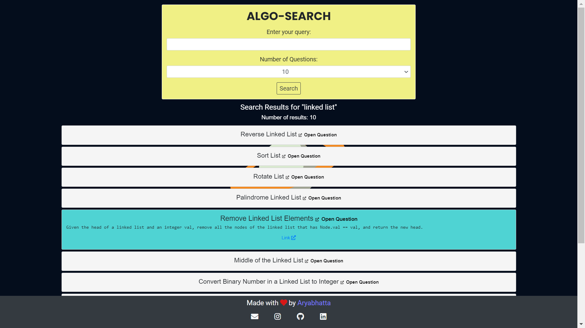

# AlgoSearch-TF-IDF

AlgoSearch is a specialized search engine created specifically for coding questions on platforms like Leetcode. It utilizes the Term Frequency-Inverse Document Frequency ([TF-IDF](https://en.wikipedia.org/wiki/Tf%E2%80%93idf)) algorithm to provide accurate search results based on user queries. TF-IDF aims to improve information retrieval by calculating the relevance of documents to a given query.

The server is live at [https://algosearch.onrender.com/](https://algosearch.onrender.com/)



## Inspiration
Have you ever felt frustrated while searching for coding questions across multiple platforms? So, why not develop our own search engine that can conveniently display results from all platforms in one place? While currently focused on LeetCode, we will be integrating other platforms like CodeChef and CodeForces later?

## Requirements


## Installation
Follow the instructions below to use AlgoSearch in your own system:

1. Clone or unzip the [repository](https://github.com/aryabhatta0/AlgoSearch-TF-IDF):

   ```bash
   git clone https://github.com/aryabhatta0/AlgoSearch-TF-IDF.git
   cd AlgoSearch-TF-IDF
   ```

2. Install the required dependencies:
    ```bash
    pip install pandas
    pip install flask
    ```

3. Rebuilding the Data [optional]
    - Preprocess scraped data:
        ```shell
        python preprocess.py
        ```
    - Prepare vocab etc. JSON files for the search engine:
        ```shell
        python prepare.py
        ```

4. Check the working of server:
    ```bash
    python app.py
    ```

## Usage

To start the search engine, run the following command in the root dir:

    flask --app app run

Open your web browser and visit [http://127.0.0.1:5000](http://127.0.0.1:5000) to access the search engine.

For demo, visit live server at [https://algosearch.onrender.com/](https://algosearch.onrender.com/)

### Interface:

- Enter your search query in the provided input box.
- Select the desired number of search results from the dropdown menu.
- Click the "Search" button to initiate the search.
- The search results will be displayed, with a link to the problem.
- Click on a question to expand and view the full content.

## Contributing

Contributions are welcome! Feel free to open pull requests for major changes or discuss any suggestions by opening an issue. 

For any queries or assistance, you can contact me at [mail.](mailto:aryabhattaaryan@gmail.com)